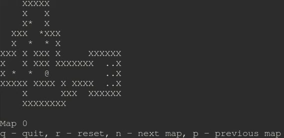

# sokoban-rust
This is a sokoban implementation written in Rust for learning purposes.

To play the game run `cargo r`, to run the tests use `cargo t`.

The maps have been copied from the [sokoban-maps](https://github.com/begoon/sokoban-maps) repository.

~~The game has no Windows support.~~